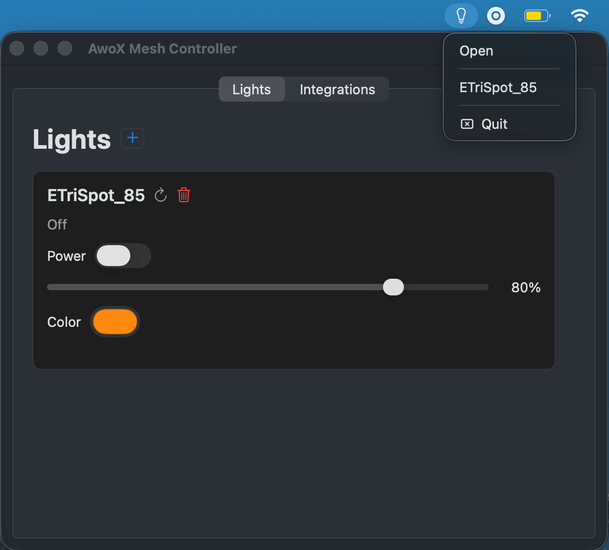

# AwoX Mesh Controller

A native macOS controller for compatible AwoX and legacy Telink private-mesh
lights. It uses CoreBluetooth and the protocol implemented by Telink's legacy
[`telink_private_mesh`](https://github.com/telink-semi/telink_private_mesh)
SDK.

The app runs entirely on the Mac, stores credentials in Keychain, and can expose
saved lights to Home Assistant through a dedicated MQTT topic namespace.

This is a personal home project intended to bridge older lights with Home
Assistant. Contributions are not expected, but you are welcome to fork the
project and adapt it for your own setup.



## Features

- Save and control multiple lights.
- Refresh authenticated power, brightness, mode, and RGB status.
- Change power, brightness, and color from each light card.
- Periodically refresh all saved lights at a configurable interval.
- Publish Home Assistant MQTT discovery and retained light state.
- Accept power, brightness, and RGB commands from dedicated MQTT command
  topics, with optional TLS and broker credentials.
- Store each light's Bluetooth identifier, display name, mesh credentials, and
  protocol address in a separate macOS Keychain item.
- View application events in a separate Logs window.
- Automatically trim runtime logs at a configurable size limit.

## Build

Requirements:

- macOS 13 or newer.
- Xcode Command Line Tools.
- A Bluetooth-capable Mac for device operation.

Full Xcode is not required. From this directory, run:

```sh
chmod +x build.sh
./build.sh
```

The script creates an ad-hoc signed application at:

```text
build/AwoX Mesh Controller.app
```

Rebuilding an ad-hoc signed app can cause macOS to request Bluetooth permission
again.

Launch the result with:

```sh
open "build/AwoX Mesh Controller.app"
```

To create a GitHub Release asset, run:

```sh
./package-release.sh
```

Upload the single ZIP from `dist/`. Its only top-level item is the application
bundle; the ZIP is necessary because a macOS `.app` is a directory rather than
a single uploadable file.

## Add A Light

1. Open the app and allow Bluetooth access.
2. Select **Device > Add Light** or press the add button.
3. Choose a discovered compatible light.
4. Enter a display name, mesh name, and mesh password.
5. Select **Add**.

The light is saved only after its credentials authenticate successfully. Each
saved profile is stored as its own Keychain item. Deleting a card asks for
confirmation and removes that Keychain item.

The mesh password is not necessarily the cloud account password. The
[community credential tool](https://fsaris.github.io/EspHome-AwoX-BLE-mesh-hub/awoxh-mesh-credentials-tool/)
can retrieve mesh credentials from an AwoX account.

## Controls

Each card provides:

- A power switch.
- A brightness slider that applies after a short debounce while dragging.
- A native color picker that applies changes immediately.
- A refresh button for an authenticated status update.
- A delete button with confirmation.

Every control command is followed by a fresh status request. The card is then
reconciled with the state reported by the light.

Use **Settings** to set the automatic refresh interval and maximum log size.
Use **Logs** to open the separate application log window. The **Integrations**
tab adds and monitors MQTT subscriptions; saved broker credentials are kept in
Keychain.

## Home Assistant MQTT

The MQTT integration defaults to the local Mosquitto broker at `localhost:1883`
and the base topic `awox-mesh-controller`. It subscribes only to this
controller's per-light command topics, not to other MQTT devices:

```text
awox-mesh-controller/<light-uuid>/set
```

Each light publishes retained JSON state to:

```text
awox-mesh-controller/<light-uuid>/state
```

The controller also publishes retained Home Assistant MQTT discovery records
to `homeassistant/light/awox_mesh_controller/<light-uuid>/config`. Home
Assistant can then send JSON power, brightness, and RGB commands and receives a
fresh state report after the corresponding Bluetooth operation completes.

See [MQTT and Home Assistant](docs/mqtt-home-assistant.md) for payload examples,
broker tests, and lifecycle details.

## Security And Data

No device identifier, mesh name, password, protocol address, or runtime log is
stored in this repository. Complete device profiles are kept in separate macOS
Keychain items under the service
`com.github.bohdandn.awox-mesh-controller.devices`. Only app settings use the
app's macOS preferences. Runtime logs are written beneath the user's Application
Support directory.

## Documentation

- [Architecture](docs/architecture.md)
- [Development and validation](docs/development.md)
- [AwoX/Telink protocol](docs/awox-protocol.md)
- [MQTT and Home Assistant](docs/mqtt-home-assistant.md)
- [Security and privacy](docs/security-and-privacy.md)
- [Contributing](docs/contributing.md)
- [AI agent instructions](AGENTS.md)

## License

Licensed under the [MIT License](LICENSE).
