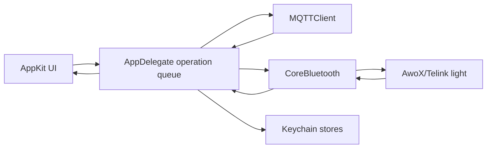

# Architecture

## Overview

AwoX Mesh Controller is a native, dependency-free macOS application. AppKit
provides the interface, CoreBluetooth communicates with compatible lights,
Security stores profiles in Keychain, and Network provides TCP/TLS for MQTT.

## Components

### Application Coordinator

`AppDelegate.swift` is the composition root. It builds the windows and menu bar
item, owns saved in-memory profiles and statuses, serializes BLE operations,
and translates MQTT commands into the same operations used by the UI.

Only one `PendingOperation` may be active. The coordinator keeps one
authenticated BLE session open for the current light. A control operation
writes its command, requests status, applies the reported status, publishes it
to MQTT, and leaves the session ready for the next command. Brightness and color
changes replace older in-flight updates and request one final status after the
interaction settles. The session is disconnected only when switching to another
light or recovering from a connection failure. New operations for the same light
replace older queued operations to avoid stale slider or color commands.

### Bluetooth And Protocol

CoreBluetooth callbacks are delivered on the main queue. Discovery accepts
advertisements with enough manufacturer data to derive the six-byte protocol
address. The controller discovers all services and identifies the three Telink
characteristics by UUID suffix.

`AwoXCrypto.swift` is a pure packet and crypto layer. `CryptoBridge.c` is the
small CommonCrypto AES-128 ECB adapter used to implement the protocol's stream
and checksum construction. See [AwoX/Telink Protocol](awox-protocol.md).

### Persistence

Each light and each MQTT integration is encoded independently as JSON and saved
as a generic-password Keychain item. App preferences use `UserDefaults`.
Runtime status, BLE session keys, and MQTT connections exist only in memory.

### MQTT Bridge

`MQTTClient.swift` is a deliberately small MQTT 3.1.1 client supporting TCP or
system-trusted TLS, optional username/password authentication, QoS 0 publish and
subscribe, retained publishes, and keepalive pings. It subscribes only to the
controller's command wildcard. Reconnect is currently user initiated.

Home Assistant discovery, command, and state behavior is owned by
`AppDelegate.swift`, not the transport. See
[MQTT and Home Assistant](mqtt-home-assistant.md).

### Views And Logging

`DeviceCardView.swift` and `IntegrationCardView.swift` expose callbacks but do
not perform BLE, persistence, or MQTT work. `AppLogger.swift` writes structured
local log lines and trims the file according to user settings.

## Key Invariants

- A BLE session key is never reused across connections.
- UI and MQTT commands share one serialized hardware path.
- Published state comes from a decrypted light response, not the requested
  value.
- Saved light UUIDs are CoreBluetooth peripheral identifiers and also form the
  stable MQTT entity identity.
- Bundle and Keychain identifiers are compatibility contracts.
